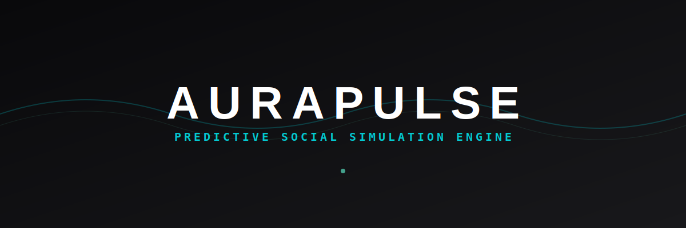
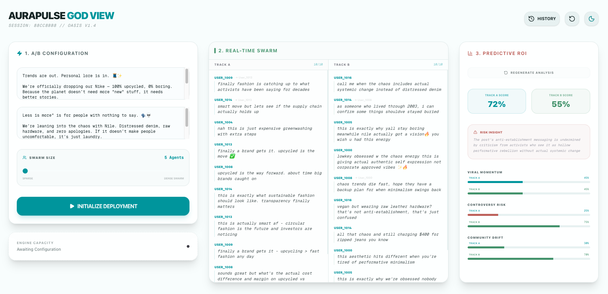

# AuraPulse: Predictive Social Simulation Engine

AuraPulse is a high-stakes social media simulation sandbox inspired by the **MiroFish** architecture. It allows talent managers and PR teams to run parallel, multi-turn AI simulations to predict audience reactions to social media posts, acting as an insurance policy against PR disasters.

## 📸 Dashboard Preview



## 🚀 Key Features

- **The "God View" Dashboard:** A real-time, three-column layout for simulation setup, live feed, and predictive analytics.
- **MiroFish OASIS Engine:** A sophisticated multi-agent framework where "Digital Twin" personas interact with each other in multi-turn simulations.
- **Parallel A/B Testing:** Compare two post versions (Track A vs. Track B) simultaneously in a single simulation run.
- **GraphRAG-Powered Grounding:** Automated Neo4j pipeline that extracts brand guidelines into a knowledge graph to ground AI agent behavior.
- **ReportAgent Analytics:** LLM-powered PR analyst that synthesizes thousands of comments into actionable ROI and Risk reports.
- **Multi-Session Persistence:** Backend-persisted drafts and simulation history, allowing multiple users or tabs to work independently without data loss.
- **Environment Isolation:** Fully separated Development and Production environments with namespaced databases (Redis DB indices and Neo4j Tenant IDs).

## 🛠 Tech Stack

### Frontend
- **Framework:** Next.js 15+ (App Router)
- **Styling:** Tailwind CSS (Custom Dark/Light Themes)
- **UI Components:** Shadcn/UI & Lucide Icons
- **Real-time:** Server-Sent Events (SSE)

### Backend
- **API:** FastAPI (Python 3.9+)
- **Task Queue:** Celery with Redis (Optimized with `solo` pool for async stability)
- **LLM Orchestration:** LiteLLM (Supporting local servers like Minimax-m2.5)
- **Database:** Neo4j (Knowledge Graph)
- **Cache/State:** Redis (Drafts, History, Reports)

---

## 🚦 Workflows

AuraPulse uses separate configuration files to isolate development and production data.

### 1. 🛠 Day-to-Day Development
Run only the infrastructure in Docker, and run the app logic locally for hot-reloading. Data is stored in **Redis DB 1**.

1.  **Configure:** Ensure `.env.development` has `REDIS_DB=1` and `APP_ENV=development`.
2.  **Start DBs:**
    ```bash
    docker-compose up -d
    ```
3.  **Run Backend (Terminal 1):**
    ```bash
    cd backend && source venv/bin/activate
    export PYTHONPATH=$PYTHONPATH:.
    uvicorn api.main:app --reload --port 8000
    ```
4.  **Run Worker (Terminal 2):**
    ```bash
    cd backend && source venv/bin/activate
    export PYTHONPATH=$PYTHONPATH:.
    celery -A engine.celery_app worker --loglevel=info -P solo
    ```
5.  **Run Frontend (Terminal 3):**
    ```bash
    cd ui && npm run dev
    ```

### 2. 🚀 Production/Deployment Mode
Run the entire containerized stack. Data is stored in **Redis DB 0**.

1.  **Configure:** Ensure `.env.production` has `REDIS_DB=0` and `APP_ENV=production`.
2.  **Start the Full Stack:**
    ```bash
    docker-compose -f docker-compose.yml -f docker-compose.prod.yml up --build -d
    ```
3.  **Stop the Full Stack:**
    ```bash
    docker-compose -f docker-compose.yml -f docker-compose.prod.yml down
    ```

---

## 🏗 Setup & Prerequisites
- Docker & Docker Compose
- Python 3.9+ (for local dev)
- Node.js 20+ (for local dev)

## 📜 License
Internal Use Only.
