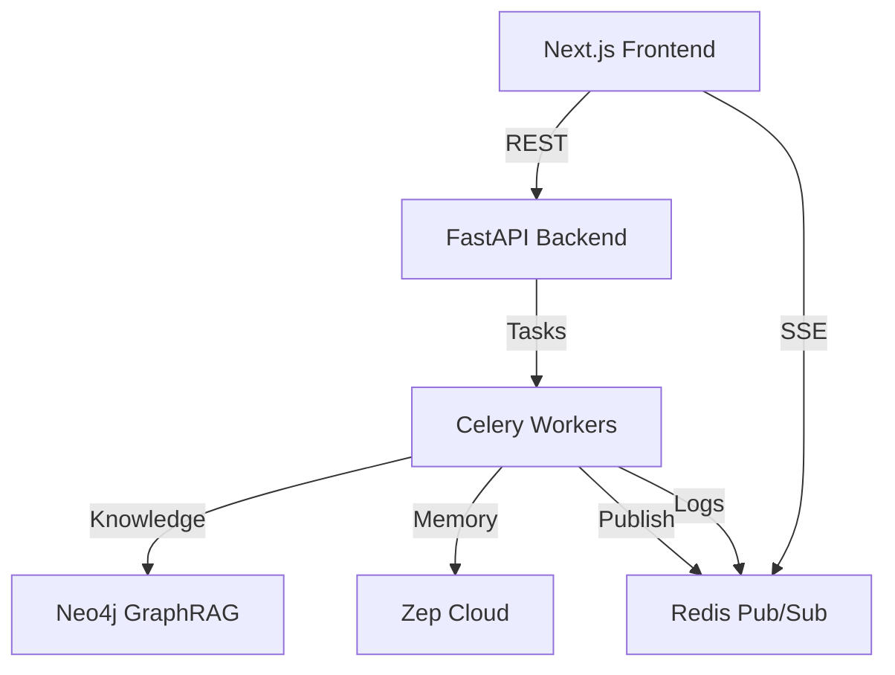

# AuraPulse: Predictive Social Simulation Engine

AuraPulse is a high-stakes social media simulation sandbox inspired by the **MiroFish** architecture. It allows talent managers and PR teams to run parallel, multi-turn AI simulations to predict audience reactions to social media posts, acting as an insurance policy against PR disasters.

## 📸 Dashboard Preview


---

## 🏗 System Architecture

AuraPulse uses a distributed, event-driven architecture designed for high-concurrency multi-agent simulations.

### High-Level Component Map



### Roles & Responsibilities

| System | Role | Technology |
| :--- | :--- | :--- |
| **Frontend** | The "God View" Dashboard | Next.js 15, Tailwind, Shadcn |
| **Orchestrator** | Task Distribution & API | FastAPI, Celery |
| **Nervous System** | Real-time Streaming & State | Redis (Pub/Sub & Hashes) |
| **Knowledge (Brain)** | Brand Guidelines & Facts | Neo4j (GraphRAG) |
| **Memory (Self)** | Agent Consistency/History | Zep Cloud |
| **Inference** | AI Persona Logic | LiteLLM (Local Minimax m2.5) |

---

## 🔄 End-to-End Data Flow

### Step 1: Grounding (Knowledge Ingestion)
*   **Action:** User pastes raw text into the "Grounding" modal.
*   **Flow:** `UI` -> `FastAPI` -> `GraphConstructor` -> `LLM` (Ontology) -> `Neo4j`.
*   **Outcome:** A connected graph of celebrity brand values, past actions, and rules.

### Step 2: Simulation Initialization
*   **Action:** User inputs Post A/B and hits "Initialize."
*   **Flow:** `UI` -> `FastAPI` -> `Celery` (run_dual_swarm).
*   **Outcome:** Two parallel simulation tracks are queued. The UI switches to "Execution" state.

### Step 3: The OASIS Multi-Agent Loop
For every agent in the swarm (Parallelized per track):
1.  **Context Retrieval:** Query `Neo4j` for 2-hop facts related to the post content.
2.  **Memory Fetch:** Query `Zep Cloud` for the agent's unique past behavior.
3.  **Inference:** Call `LLM` with [Persona + Grounding + Memory].
4.  **Broadcast:** 
    *   Publish comment to `Redis sim_stream` (for real-time UI update).
    *   Push comment to `Redis logs:{sim_id}` (for permanent history).
    *   Save comment to `Zep Cloud` (for future consistency).

### Step 4: Strategic Synthesis (ReportAgent)
*   **Action:** Simulation completes (all agents responded).
*   **Flow:** `UI` -> `FastAPI` -> `ReportAgent` -> `LLM` (Analyst).
*   **Outcome:** The full log is summarized into JSON: Viral Momentum, Brand Risk, and Community Drift.

### Step 5: Persistence
*   **Action:** User refreshes page or opens a new tab.
*   **Flow:** `UI` -> `FastAPI` -> `Redis` (HGETALL draft/history).
*   **Outcome:** The state is fully reconstructed from the backend database.

---

## 🚦 Workflows

AuraPulse uses separate configuration files to isolate development and production data.

### 1. 🛠 Day-to-Day Development (Recommended)
Run infrastructure in Docker, and app logic locally. Data is stored in **Redis DB 1**.

1.  **Launch everything:** `./dev.sh`
2.  **Access:** [http://localhost:3000](http://localhost:3000)
3.  **Logs:** `~/.aura/backend.log` and `~/.aura/celery.log`.

### 2. 🚀 Production/Deployment Mode
Run the entire containerized stack. Data is stored in **Redis DB 0**.

1.  **Start Stack:** `docker-compose -f docker-compose.yml -f docker-compose.prod.yml up --build -d`

---

## 🧪 Testing

AuraPulse includes a comprehensive end-to-end test suite to verify the entire pipeline.

### 1. Automated (Recommended)
Run the entire stack, execute tests, and clean up with one command:
```bash
./test.sh
```

### 2. Manual
If the development environment is already running:
```bash
cd backend && source venv/bin/activate
pytest ../tests/test_e2e.py
```

## 📜 License
Internal Use Only.
